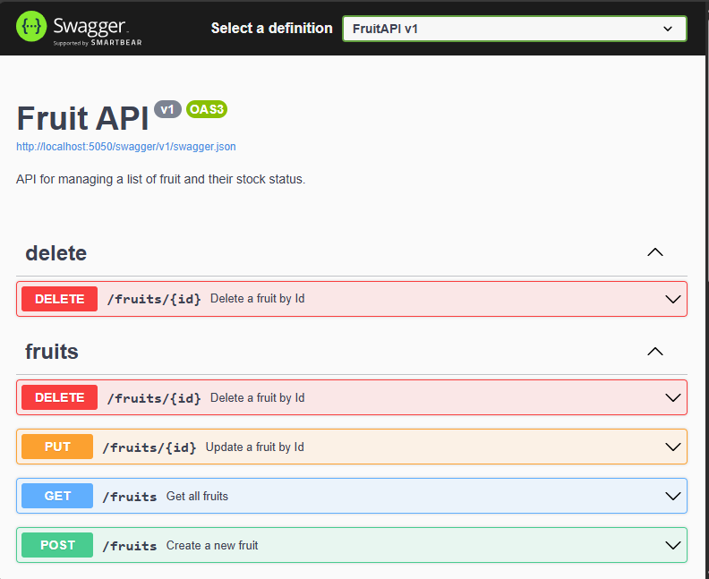

---
lab:
  title: 练习：与 ASP.NET Core 最小 API 交互
  module: 'Module: Interact with an ASP.NET Core minimal API'
---

在本练习中，你将在本地运行 ASP.NET Core 最小 API，并浏览该 API 和基础代码。 您还可以将 API 发布到 Azure 应用服务。 

完成本练习后，您将能够

* 浏览记录的 API
* 确定 HTTP 操作的终结点
* 确定 HTTP 操作的 API 要求
* 将应用程序发布到 Azure 应用程序服务

## 先决条件

要完成本练习，您需要在系统中安装以下设备：

* 
[Visual Studio Code](https://code.visualstudio.com)

* 
[最新的 .NET 7.0 SDK。](https://dotnet.microsoft.com/download/dotnet/7.0)
* Visual Studio Code 的[C# 扩展](https://marketplace.visualstudio.com/items?itemName=ms-dotnettools.csharp)

* Visual Studio Code 的[Azure 资源](https://marketplace.visualstudio.com/items?itemName=ms-azuretools.vscode-azureresourcegroups)扩展。
* Visual Studio Code 的[Azure 应用服务](https://marketplace.visualstudio.com/items?itemName=ms-azuretools.vscode-azureappservice)扩展。
* 具有活动订阅的 Azure 帐户。 如果你还没有，可在[
https://azure.com/free
](https://azure.com/free)注册免费试用版。


**预计练习完成时间**：30 分钟

## API 信息

API 与内存数据库交互，该数据库包含以下字段：

字段 | 类型​​ | 说明
--- | --- | ---
`id` | integer | 数据密钥
`name` | string | 水果名称
`instock` | boolean | 表示水果是否有库存

Swagger 文档是使用 Swashbuckle 软件包创建的。

>
**注意：** 每次启动 API 都会创建样本数据。


## 下载并运行 Fruit API 代码

在本部分，你将执行以下操作：

* 下载 API 代码
* 在本地运行 API
* 在浏览器中打开 API 文档

### 任务 1： 下载 API 代码

1. 右键单击以下链接并选择**另存链接**选项。 

    * 
[FruitAPI 项目](https://raw.githubusercontent.com/MicrosoftLearning/APL-2002-develop-aspnet-core-consumes-api/master/Allfiles/Downloads/FruitAPI.zip)代码

1. 启动**文件资源管理器**并导航到文件保存的位置。

1. 将文件解压缩到它自己的文件夹中。

#### 任务 2：在本地运行 API

1. 启动 Visual Studio Code，在菜单栏中选择**文件**，然后选择**打开文件夹......**。

1. 导航到解压项目文件的位置，然后选择*FruitAPI*文件夹。

1. 
**资源管理器**窗格中的项目结构应与下面的截图相似。 如果**资源管理器**窗格不可见，请选择**查看**，然后在菜单栏中选择**资源管理器**。

    

1. 选择**终端**，然后选择**新建终端**，或使用键盘快捷键**Ctrl+Shift+`**，打开终端。

1. 在**终端**窗格中运行以下`dotnet`命令：

    ```
    dotnet run
    ```

1. 以下是在**终端**窗格中看到的输出示例。 请注意`Now listening on: http://localhost:5050`输出中的一行。 它标识了 API 的主机和端口。

    ```
    info: Microsoft.EntityFrameworkCore.Update[30100]
          Saved 3 entities to in-memory store.
    info: Microsoft.Hosting.Lifetime[14]
          Now listening on: http://localhost:5050
    info: Microsoft.Hosting.Lifetime[0]
          Application started. Press Ctrl+C to shut down.
    info: Microsoft.Hosting.Lifetime[0]
          Hosting environment: Development
    info: Microsoft.Hosting.Lifetime[0]
          Content root path: 
          <project location>
    ```

### 任务 3：在浏览器中打开 API 文档

1. 要查看 API，既可以输入`http://localhost:5050`地址栏，也可以按住**Ctrl+ 单击**之前显示的**终端**中的`Now listening on: http://localhost:5050`链接。 页面会显示 "找不到此 localhost 页面 "的信息。

1. 在浏览器中用......添加 URL`/swagger`。 终结点`/swagger`通常是你能找到 Swagger API 文档的地方。 Swagger 文档的完整 URL 是`http://localhost:5050/swagger`. 现在，您的浏览器应该会显示与以下截图类似的网页：

    

## 在 API 中执行操作

在本部分，你将执行以下操作：

* 对样本数据执行若干操作
* 确定操作的终结点和数据要求

### 任务 1：执行`GET`操作

1. 单击**GET**操作框中的任意位置，展开**获取所有结果**部分中的**GET**操作。

1. 探索操作的各个部分，并注意下表中显示的信息。

    | 部分 | 说明 |
    |---|--|
    | 
**终结点**
 | 显示在操作标题中。 端点显示为`/fruitlist`. 
`http://localhost:5050/fruitlist`在我们的示例中，完整 URI 是 API 的基本 URL，并附加了指定的终结点。 |
    | 
**Parameters**
 | 此操作不需要。 |
    | 
**媒体类型**
 | 指定操作将返回的媒体类型编码。 |
    | 
**示例值**
 | 显示操作返回的数据模式。 请注意，此操作会返回一个 JSON 数组。 |

1. 选择**试用**按钮，然后选择**执行**，运行操作。

1. 操作的**响应**部分已更新为新信息。 注意以下事项：

    * 
**请求 URL：** 操作中访问的 URL。
    * 
**服务器响应：** 显示操作的成功代码，**响应正文**显示三条样本记录。

### 任务 2：执行`POST`操作

1. 单击**POST**操作框中的任意位置，在**添加水果到列表**部分展开**POST**操作。

1. 探索操作的各个部分，并注意下表中显示的信息。

    | 部分 | 说明 |
    |---|--|
    | 
**终结点**
 | 端点显示为`/fruitlist`. 
`http://localhost:5050/fruitlist`在我们的示例中，完整 URI 是 API 的基本 URL，并附加了指定的终结点。 |
    | 
**Parameters**
 | 此操作不需要。 |
    | 
**请求正文**
 | 
**请求正文**是必需的，因为 API 希望将数据添加到列表中，并且希望得到媒体类型`application/json`。 |
    | 
**示例值**
 | 显示 API 期望接收的数据模式。 |  

1. 要运行操作，请选择**试用**按钮。 

1. 将**请求正文**部分下输入框中的 JSON 替换为以下内容：

    ```json
    {
        "id": 0,
        "name": "Pear",
        "instock": true
    }
    ```

    >
**注意：** 添加数据时，数据库会分配自己的索引值，因此只需在`id`字段中有一个值即可。

1. 操作的**响应**部分已更新为新信息。 注意以下事项：

    * 
**请求 URL：** 操作中访问的 URL。
    * 
**服务器响应：** 显示操作的成功代码，**响应正文**显示添加到数据库的记录。

1. 运行**获取列表中的所有水果**部分中的`GET`命令，注意现在已包含一条*Pear*的记录。

### 任务 3：执行`DELETE`操作

1. 单击**DELETE**操作框中的任意位置，展开**按 ID 删除水果**部分中的**DELETE**操作。

1. 探索操作的各个部分，并注意下表中显示的信息。

    | 部分 | 说明 |
    |---|--|
    | 
**终结点**
 | 端点显示为`/fruitlist/{id}`. 完整 URI 是 API 的基本 URL，并附加了指定的`id`删除内容。 例如，`http://localhost:5050/fruitlist/1`指向`id`等于`1`.
    | 
**Parameters**
 | 要求`id`在请求 URL 中传递记录的。 |

1. 要运行操作，请选择**试用**按钮。 

1. 在**参数**部分的`id`字段中输入 a`1`，然后选择**执行**，即可删除`Apple`样本数据中的记录。

1. 操作的**响应**部分已更新为新信息。 注意以下事项：

    * 
**请求 URL：** 操作中访问的 URL。
    * 
**响应正文：** 显示删除的记录。
    * 
**代码：** 显示操作的成功代码。

1. 运行**获取列表中的所有水果**部分中的`GET`命令，注意*Apple*的记录已被删除。

准备好进入下一节练习时，请执行以下操作

* 关闭浏览器，在运行 Fruit API 的`Ctrl + C`终端输入停止该 API 的命令。

## 将应用程序接口发布到 Azure 应用服务

在本部分，你将执行以下操作：

* 使用 Azure 资源扩展连接到 Azure
* 使用 Azure App 服务扩展将 API 发布到应用服务

### 任务 1：登录到 Azure

1. 选择Azure 资源扩展打开面板。

    

1. 选择**登录到 Azure......** 

    将打开一个浏览器窗口，提示登录到 Azure 帐户。 完成登录后，可以关闭此窗口。 

1. 登录完成后，扩展将显示账户中可用订阅的列表。 下面的截图就是一个例子。

    

### 任务 2：创建新的网络应用程序

1. 选择**Ctrl + Shift + P**打开命令面板，然后输入**创建新 Web 应用程序**筛选列表并选择**Azure 应用服务：创建新 Web 应用程序......（高级）** 选项。 

1. 如果您的账户有多个订阅，系统将提示您选择要用于部署的订阅。 

1. 为新 Web 应用输入全局唯一名称。 您可以尝试，`fruitapi-<name>`然后用您的姓名或姓名首字母替换`<name>`。

1. 选择 **+创建新资源组**，接受默认值或输入`fruitapi-rg`。

1. 为运行时堆栈选择 **.NET 7 (STS)**。

1. 操作系统选择**Linux**


1. 为新资源选择一个离您较近的位置。

1. 选择**创建新的应用服务计划**，并接受默认值或输入其他名称。 

1. 为定价层选择**免费 (F1) 免费试用 Azure**。

1. 当提示需要新的 Application Insights 资源时，选择**暂时跳过**。

该工具将在 Azure 中创建必要的资源并编译代码。

### 任务 3：部署网络应用程序并浏览运行网站

1. 资源创建和代码编译完成后，会弹出一个窗口提示您**部署**，请选择**部署**选项。 

    系统将构建代码的发布版本，并将其部署到你之前创建的资源中。

1. 部署完成后，会弹出一个新的窗口，提供**浏览网站**选项，选择**浏览网站**。

1. 在打开的浏览器窗口中，在 URL 的末尾添加`/swagger`。 

恭喜，您已成功将 API 部署到 Azure App 服务。

>
**注意：** 从 Azure 中删除不再需要的资源是一种很好的做法。 可以通过删除之前在 Azure 门户中创建的资源组来删除本部分练习中创建的所有资源。

## 审阅

在本练习中，你了解了如何：

* 浏览记录的 API
* 确定 HTTP 操作的终结点
* 确定 HTTP 操作的 API 要求
* 将应用程序发布到 Azure 应用程序服务 
