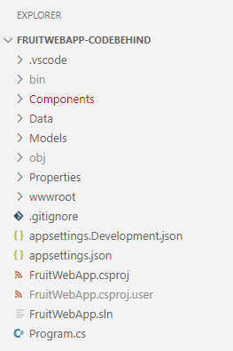

---
lab:
  title: 练习：在 ASP.NET Core Blazor Web 应用中实现 HTTP 操作
  module: 'Module: Implement HTTP operations in ASP.NET Core Blazor Web apps'
---

在本练习中，你将了解如何将代码添加到 ASP.NET Core Blazor Web 应用，以创建 HTTP 客户端并执行 `GET`、`POST`、`PUT` 和 `DELETE` 操作。 该代码已添加到 *.razor.cs* 代码隐藏文件中。 呈现 *.razor* 文件中数据的代码已完成。

## 目标

完成此练习后，你将能够：

* 执行`IHttpClientFactory`作为 HTTP 客户端
* 在 ASP.NET Blazor Web 应用中实现 HTTP 操作

## 先决条件

要完成本练习，您需要在系统中安装以下设备：

* [Visual Studio Code](https://code.visualstudio.com)
* [最新的 .NET 8.0 SDK](https://dotnet.microsoft.com/download/dotnet/8.0)
* Visual Studio Code 的 [C# 扩展](https://marketplace.visualstudio.com/items?itemName=ms-dotnettools.csharp)

**预计练习完成时间**：30 分钟

## 练习场景

本练习包含两个部分：

* 向 API 发送 HTTP 请求的应用程序。 Web 应用在 `http://localhost:5010` 上运行。
* 响应 HTTP 请求的 API。 该 API 在 `http://localhost:5050`上运行。


## 下载代码

在本节中，您将下载 Fruit 网络应用程序和 Fruit API 的代码。 您还将在本地运行 Fruit API，以便它可用于网络应用程序。

### 任务 1： 下载并运行 API 代码

1. 右键单击以下链接并选择**另存链接**选项。 

    * [FruitAPI 项目](https://raw.githubusercontent.com/MicrosoftLearning/APL-2002-develop-aspnet-core-consumes-api/master/Allfiles/Downloads/FruitAPI.zip)代码

1. 启动**文件资源管理器**并导航到文件保存的位置。

1. 将文件解压缩到它自己的文件夹中。

1. 打开 **Windows 终端**或**命令提示符**，并导航到提取 API 代码的位置。

1. 在**Windows 终端**窗格中运行以下`dotnet`命令：

    ```
    dotnet run
    ```

1. 以下是生成的输出示例。 请注意`Now listening on: http://localhost:5050`输出中的一行。 它标识了 API 的主机和端口。

    ```
    info: Microsoft.EntityFrameworkCore.Update[30100]
          Saved 3 entities to in-memory store.
    info: Microsoft.Hosting.Lifetime[14]
          Now listening on: http://localhost:5050
    info: Microsoft.Hosting.Lifetime[0]
          Application started. Press Ctrl+C to shut down.
    info: Microsoft.Hosting.Lifetime[0]
          Hosting environment: Development
    info: Microsoft.Hosting.Lifetime[0]
          Content root path: 
          <project location>
    ```

>**注意：** 在接下来的练习中，让 Fruit API 一直处于运行状态。 

### 任务 2：下载并打开网络应用程序项目

1. 右键单击以下链接并选择**另存链接**选项。 

    * [Fruit 网络应用程序代码后端的项目代码](https://raw.githubusercontent.com/MicrosoftLearning/APL-2002-develop-aspnet-core-consumes-api/master/Allfiles/Downloads/FruitWebApp-codebehind.zip)

1. 启动**文件资源管理器**并导航到文件保存的位置。

1. 将文件解压缩到它自己的文件夹中。

1. 启动 Visual Studio Code，在菜单栏中选择**文件**，然后选择**打开文件夹......**。

1. 导航到解压项目文件的位置，然后选择 *FruitWebApp-codebehind* 文件夹。

1. **资源管理器**窗格中的项目结构应与下面的截图相似。 如果**资源管理器**窗格不可见，请选择**查看**，然后在菜单栏中选择**资源管理器**。

    

>**注意：** 请花时间查看本练习中编辑的每个文件中的代码。 这些代码都有大量注释，可以帮助你理解代码库。

## 为 HTTP 客户端和 HTTP 操作执行代码

Fruit Web 应用在主页上显示 API 示例数据，并添加、编辑和删除功能。 需要添加代码来实现 HTTP 客户端操作。 

### 任务 1：实现 HTTP 客户端

1. 在**资源管理器**窗格中选择 *Program.cs* 文件，打开该文件进行编辑。

1. 在 `// Begin HTTP client code` 和 `// End of HTTP client code` 注释之间添加以下代码。

    ```csharp
    // Add IHttpClientFactory to the container and set the name of the factory
    // to "FruitAPI". The base address for API requests is also set.
    builder.Services.AddHttpClient("FruitAPI", httpClient =>
    {
        httpClient.BaseAddress = new Uri("http://localhost:5050/");
    });
    ```

1. 保存对 Program.cs 所做的更改**。

### 任务 2：执行 GET 操作

1. 在“**资源管理器**”窗格中，选择 *home.razor.cs* 文件，打开该文件进行编辑。 它位于 `Components/Pages` 文件夹中。

1. 在 `// Begin GET operation code` 和 `// End GET operation code` 注释之间添加以下代码。

    ```csharp
    protected override async Task OnInitializedAsync()
    {
        // Create the HTTP client using the FruitAPI named factory
        var httpClient = HttpClientFactory.CreateClient("FruitAPI");

        // Perform the GET request and store the response. The parameter
        // in GetAsync specifies the endpoint in the API 
        using HttpResponseMessage response = await httpClient.GetAsync("/fruits");

        // If the request is successful deserialize the results into the data model
        if (response.IsSuccessStatusCode)
        {
            using var contentStream = await response.Content.ReadAsStreamAsync();
            _fruitList = await JsonSerializer.DeserializeAsync<IEnumerable<FruitModel>>(contentStream);
        }
        else
        {
            // If the request is unsuccessful, log the error message
            Console.WriteLine($"Failed to load fruit list. Status code: {response.StatusCode}");
        }
    }
    ```

1. 将更改保存到 *Home.razor.cs*。

1. 查看 *Home.razor.cs* 文件中的代码。 注意在页面上使用依赖注入添加`IHttpClientFactory`。

### 任务 3：实现 POST 操作

1. 在“**资源管理器**”窗格中，选择 *Add.cshtml* 文件，打开该文件进行编辑。

1. 在 `// Begin POST operation code` 和 `// End POST operation code` 注释之间添加以下代码。

    ```csharp
    private async Task Submit()
    {
        // Serialize the information to be added to the database
        var jsonContent = new StringContent(JsonSerializer.Serialize(_fruitList),
            Encoding.UTF8,
            "application/json");

        // Create the HTTP client using the FruitAPI named factory
        var httpClient = HttpClientFactory.CreateClient("FruitAPI");

        // Execute the POST request and store the response. The response will contain the new record's ID
        using HttpResponseMessage response = await httpClient.PostAsync("/fruits", jsonContent);

        // Check if the operation was successful, and navigate to the home page if it was
        if (response.IsSuccessStatusCode)
        {
            NavigationManager?.NavigateTo("/");
        }
        else
        {
            Console.WriteLine("Failed to add fruit. Status code: {response.StatusCode}");
        }
    }
    ```

1. 保存对 *Add.razor.cs* 的更改，并查看代码中的注释。

### 任务 4：实现 PUT 操作

1. 在“**资源管理器**”窗格中，选择 *Edit.razor.cs* 文件，打开该文件进行编辑。

1. 在 `// Begin PUT operation code` 和 `// End PUT operation code` 注释之间添加以下代码。

    ```csharp
    private async Task Submit()
    {
        // Create the HTTP client using the FruitAPI named factory
        var httpClient = HttpClientFactory.CreateClient("FruitAPI");

        // Store the updated data in a JSON object
        var jsonContent = new StringContent(JsonSerializer.Serialize(_fruitList), 
            Encoding.UTF8, "application/json");

        // Execute the PUT request
        using HttpResponseMessage response = await httpClient.PutAsync($"/fruits/{Id}", jsonContent);

        // If the response is successful, navigate back to the home page 
        if (response.IsSuccessStatusCode)
        {
            NavigationManager?.NavigateTo("/");
        }
        else
        {
            Console.WriteLine("Failed to update fruit with edits. Status code: {response.StatusCode}");
        }
    }
    ```

1. 保存对 *Edit.razor.cs* 的更改，并查看代码中的注释。

### 任务 5：实现 DELETE 操作

1. 在“**资源管理器**”窗格中，选择 *Delete.razor.cs* 文件，打开该文件进行编辑。

1. 在 `// Begin DELETE operation code` 和 `// End DELETE operation code` 注释之间添加以下代码。

    ```csharp
    private async Task Submit()
    {
        // Create the HTTP client using the FruitAPI named factory
        var httpClient = HttpClientFactory.CreateClient("FruitAPI");

        // Execute the DELETE request and store the response
        using HttpResponseMessage response = await httpClient.DeleteAsync("/fruits/" + Id.ToString());

        // Return to the home page 
        if (response.IsSuccessStatusCode)
        {
            NavigationManager?.NavigateTo("/");
        }
        else
        {
            Console.WriteLine("Failed to delete fruit. Status code: {response.StatusCode}");
        }
    }
    ```

1. 保存对 *Delete.razor.cs* 的更改，并查看代码中的注释。

## 运行并测试 Web 应用

### 任务 1：运行 Web 应用

1. 在 Visual Studio Code 顶部菜单中选择**运行\|开始调试**，或选择 **F5**。 项目构建完成后，浏览器窗口将启动，网络应用程序将运行并显示 API 示例数据，如下截图所示。

    

    >**注意：** 如果运行应用程序时出现下面的提示，您可以放心地忽略它。

    

### 任务 1：测试 Web 应用

1. 选择**添加到列表**按钮并填写生成的表单。 然后，选择**创建**按钮。

1. 确认您添加的内容是否出现在列表底部。

1. 在列表中选择一个要编辑的项目，然后选择**编辑**按钮。 
1. 编辑**水果名称**和**可用？** 字段，然后选择**更新**。

1. 确认您的更改是否出现在列表中。 

1. 在列表中选择要删除的项目，然后选择**删除**按钮。

1. 在“删除”页上，验证所选项是否显示，然后单击“删除”按钮。****

1. 确认该项目不再出现在列表中。

准备结束练习时：

* 关闭浏览器或浏览器选项卡，在 Visual Studio Code 中选择**运行 \| 停止调试** 或 **Shift + F5**。 

* 在 Fruit API 运行的终端中输入 **Ctrl + C**，停止 Fruit API。

## 审阅

在本练习中，你了解了如何：

* 执行`IHttpClientFactory`作为 HTTP 客户端
* 在 ASP.NET Core Blazor 代码隐藏文件中实现 HTTP 操作
